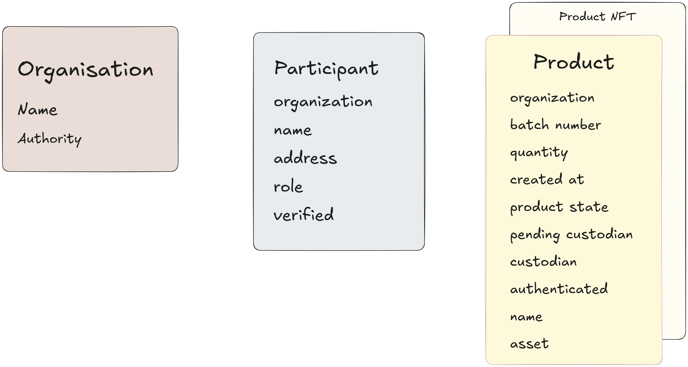

### Supply Chain Tracker App

#### Entities

- organization: Represents the company which participants and products are linked to.
- participants: All participant within an organization; participants can have one of three roles:
  - Manufacturer: An organizationally unique role that allows a participant to create a product, generate an authentication seal, and register other participants.
  - Distributor: A non unique role that allows a participant to sign for and transfer a product.
  - Retailer: A non uqnique role representing the destination of a product.
- product: Products are represented on chain both as an account which serves as a finite state machine and as an NFT.

